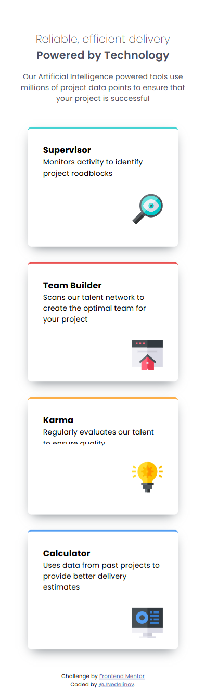
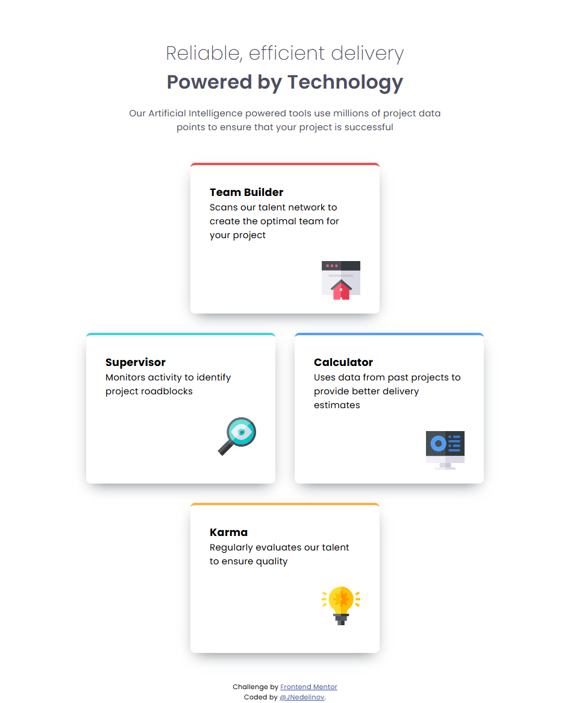
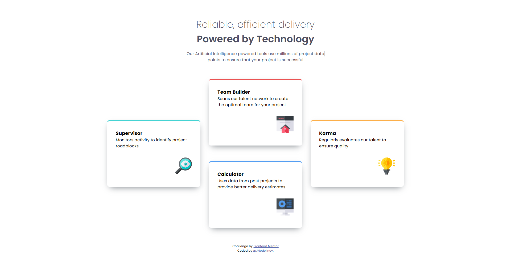

# Frontend Mentor - Four card feature section solution

This is a solution to the [Four card feature section challenge on Frontend Mentor](https://www.frontendmentor.io/challenges/four-card-feature-section-weK1eFYK). Frontend Mentor challenges help you improve your coding skills by building realistic projects. 

## Table of contents

- [Frontend Mentor - Four card feature section solution](#frontend-mentor---four-card-feature-section-solution)
  - [Table of contents](#table-of-contents)
  - [Overview](#overview)
    - [The challenge](#the-challenge)
    - [Screenshot](#screenshot)
      - [Mobile](#mobile)
      - [Tablet](#tablet)
      - [Desktop](#desktop)
    - [Links](#links)
  - [My process](#my-process)
    - [Built with](#built-with)
    - [What I learned](#what-i-learned)
    - [Continued development](#continued-development)
    - [Useful resources](#useful-resources)
  - [Author](#author)

## Overview

### The challenge

Users should be able to:

- View the optimal layout for the site depending on their device's screen size

### Screenshot

#### Mobile


#### Tablet


#### Desktop


### Links

- Solution URL: [Add your GitHub URL here](https://github.com/JNedelinov/four-card-feature-section)
- Live Site URL: [Add your Netlify/Vercel URL here](https://your-live-site-url.com)

## My process

### Built with

- Semantic HTML5 markup
- CSS custom properties (Variables)
- Flexbox (Component-level layout)
- CSS Grid (Page-level layout)
- Mobile-first workflow

### What I learned

This challenge was an excellent opportunity to dive deep into **CSS Grid**, specifically using `grid-template-areas` to create complex, responsive layouts with very little code.

Instead of struggling with complex column/row math to position the cards, I mapped out the layout visually using grid areas. This made the CSS incredibly readable and easy to adapt across different screen sizes:

**Tablet Layout Implementation:**
```css
@media only screen and (min-width: 768px) and (max-width: 1023px) {
  main {
    display: grid;
    grid-template-areas:
      'teambuilder teambuilder'
      'supervisor karma'
      'calculator calculator';
  }
}

@media (min-width: 1024px) {
  main {
    display: grid;

    grid-template-rows: repeat(2, 1fr);
    grid-template-columns: repeat(3, 1fr);

    grid-template-areas:
      'supervisor teambuilder calculator'
      'supervisor karma calculator';
  }
}
```

### Continued development

Sometimes I still cannot take a quick decision what font-sizes or HTML elements to use for headings and in this challenge, I used 'h2' headings and changed their 'font-size' based on the device **WHILE** still not confident enough in selecting the right size **BECAUSE** in the figma design they were 32px for mobile, but when compared with my solution when 32px were applied, the headings were waaay to big than the design. 

### Useful resources

- [CSS Grid](https://www.joshwcomeau.com/css/interactive-guide-to-grid/) - This helped me reminding myself of the CSS Grid use and how Grid Area works. (it was proposed by Frontend Mentor at the beginning of the challenge)

## Author

- GitHub - [@jnedelinov](https://github.com/JNedelinov)
- Frontend Mentor - [@jnedelinov](https://www.frontendmentor.io/profile/JNedelinov)
